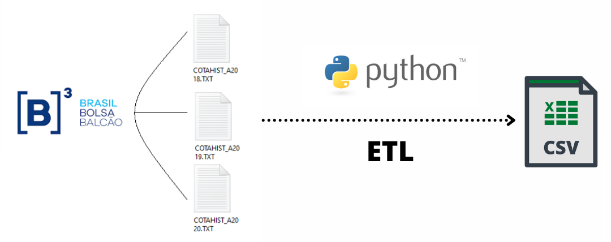

# Finance and Stocks Analytics

*Finance Market Analysis with Python*

Artigos que exploram como usar Python para analisar/visualizar e tentar prever o movimento de ações. Também nos concentraremos em bibliotecas orientadas para o mercado financeiro.

  

   

**Background in:** Mathematics, Python, Machine Learning and Applied Math.

**Links:**
* [LinkedIn](https://www.linkedin.com/in/joão-pedro-lavor-65162312b/)
* [Medium](https://jplavorr.medium.com/)

# Projetos:
## [ ETL on B3 Data](https://bit.ly/2XiGHJB): 

### Introdução
Irei utilizar o ETL (extraction, Transformation and Load) a partir dos dados das cotações históricas da B3, transformá-los a partir de alguma regra e disponibiliza-los nesse repositório. Essa ETL servirá como base para alimentar futuros artigos sobre análise de dados e machine learning sobre dados da Bovespa.

### Data 

Se trata de um arquivo posicional, aonde os dados estão disponibilizados em uma string no formato txt. Iremos transformá-los com a ajuda do layout disponibilizado pela B3 ([LAYOUT DO ARQUIVO – COTAÇÕES HISTÓRICAS](http://www.b3.com.br/data/files/C8/F3/08/B4/297BE410F816C9E492D828A8/SeriesHistoricas_Layout.pdf)) e retirarmos as informações que queremos e disponibilizarmos de maneira simples.

### ETL Pipeline

O ETL pipeline extrai automaticamente os dados dos arquivos `COTAHIST_A{Ano}.TXT` e cria um arquivo csv utilizando o script `ETL_Bovespa.ipynb`, como você pode observar na imagem abaixo

### Pré-requisitos

- Usar Google Colab ou Jupyter. 
- Ir no site da B3 baixar as cotações históricas.
- Abrir Layout das cotações históricas para retirada dos dados.

Se você deseja executar esse projeto em sua máquina, basta alterar o código de forma que encontre os arquivos com o caminho dentro do seu computador (Análogo ao Jupyter).

